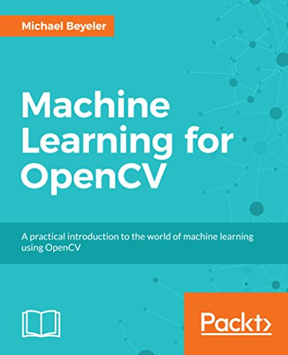

# Machine Learning for OpenCV

[](https://groups.google.com/d/forum/machine-learning-for-opencv)
[](http://beta.mybinder.org/v2/gh/mbeyeler/opencv-machine-learning/master)
[](https://doi.org/10.5281/zenodo.833523)

This is the Jupyter notebook version of the following book:

 <br/>
Michael Beyeler <br/>
<a href="https://www.packtpub.com/big-data-and-business-intelligence/machine-learning-opencv" target="_blank"><b>Machine Learning for OpenCV: A practical introduction to the world of machine learning and image processing using OpenCV and Python</b></a>
<br/><br/>
14 July 2017 <br/>
Packt Publishing Ltd., London, England <br/>
Paperback: 382 pages <br/>
ISBN 978-178398028-4
<br clear="both"/><br/>

The content is available on [GitHub](https://github.com/mbeyeler/opencv-machine-learning).
The code is released under the [MIT license](https://opensource.org/licenses/MIT).

For questions, discussions, and more detailed help please refer to the [Google group](https://groups.google.com/d/forum/opencv-python-blueprints).

If you use either book or code in a scholarly publication, please cite as:

> M. Beyeler, (2017). Machine Learning for OpenCV. Packt Publishing Ltd., London, England, 380 pages, ISBN 978-178398028-4.

Or use the following bibtex:

```
@book{MachineLearningOpenCV,
	title = {{Machine Learning for OpenCV}},
	subtitle = {{A practical introduction to the world of machine learning and image processing using OpenCV and Python}},
	author = {Michael Beyeler},
	year = {2017},
	pages = {380},
	publisher = {Packt Publishing Ltd.},
	isbn = {978-178398028-4}
}
```


## Table of Contents

[Preface](notebooks/00.00-Preface.ipynb)

[Foreword by Ariel Rokem](notebooks/00.01-Foreword-by-Ariel-Rokem.ipynb)

1. [A Taste of Machine Learning](notebooks/01.00-A-Taste-of-Machine-Learning.ipynb)

2. [Working with Data in OpenCV](notebooks/02.00-Working-with-Data-in-OpenCV.ipynb)
   - [Dealing with Data Using Python's NumPy Package](notebooks/02.01-Dealing-with-Data-Using-Python-NumPy.ipynb)
   - [Loading External Datasets in Python](notebooks/02.02-Loading-External-Datasets-in-Python.ipynb)
   - [Visualizing Data Using Matplotlib](notebooks/02.03-Visualizing-Data-Using-Matplotlib.ipynb)
   - [Dealing with Data Using OpenCV's TrainData container](notebooks/02.05-Dealing-with-Data-Using-the-OpenCV-TrainData-Container-in-C%2B%2B.ipynb)

3. [First Steps in Supervised Learning](notebooks/03.00-First-Steps-in-Supervised-Learning.ipynb)
   - [Measuring Model Performance with Scoring Functions](notebooks/03.01-Measuring-Model-Performance-with-Scoring-Functions.ipynb)
   - [Understanding the k-NN Algorithm](notebooks/03.02-Understanding-the-k-NN-Algorithm.ipynb)
   - [Using Regression Models to Predict Continuous Outcomes](notebooks/03.03-Using-Regression-Models-to-Predict-Continuous-Outcomes.ipynb)
   - [Applying Lasso and Ridge Regression](notebooks/03.04-Applying-Lasso-and-Ridge-Regression.ipynb)
   - [Classifying Iris Species Using Logistic Regression](notebooks/03.05-Classifying-Iris-Species-Using-Logistic-Regression.ipynb)

4. [Representing Data and Engineering Features](notebooks/04.00-Representing-Data-and-Engineering-Features.ipynb)
   - [Preprocessing Data](notebooks/04.01-Preprocessing-Data.ipynb)
   - [Reducing the Dimensionality of the Data](notebooks/04.02-Reducing-the-Dimensionality-of-the-Data.ipynb)
   - [Representing Categorical Variables](notebooks/04.03-Representing-Categorical-Variables.ipynb)
   - [Representing Text Features](notebooks/04.04-Represening-Text-Features.ipynb)
   - [Representing Images](notebooks/04.05-Representing-Images.ipynb)

5. [Using Decision Trees to Make a Medical Diagnosis](notebooks/05.00-Using-Decision-Trees-to-Make-a-Medical-Diagnosis.ipynb)
   - [Building Your First Decision Tree](notebooks/05.01-Building-Your-First-Decision-Tree.ipynb)
   - [Using Decision Trees to Diagnose Breast Cancer](notebooks/05.02-Using-Decision-Trees-to-Diagnose-Breast-Cancer.ipynb)
   - [Using Decision Trees for Regression](notebooks/05.03-Using-Decision-Trees-for-Regression.ipynb)

6. [Detecting Pedestrians with Support Vector Machines](notebooks/06.00-Detecting-Pedestrians-with-Support-Vector-Machines.ipynb)
   - [Implementing Your First Support Vector Machine](notebooks/06.01-Implementing-Your-First-Support-Vector-Machine.ipynb)
   - [Detecting Pedestrians in the Wild](notebooks/06.02-Detecting-Pedestrians-in-the-Wild.ipynb)
   - [Additional SVM Exercises](notebooks/06.03-Additional-SVM-Exercises.ipynb)

7. [Implementing a Spam Filter with Bayesian Learning](notebooks/07.00-Implementing-a-Spam-Filter-with-Bayesian-Learning.ipynb)
   - [Implementing Our First Bayesian Classifier](notebooks/07.01-Implementing-Our-First-Bayesian-Classifier.ipynb)
   - [Classifying E-Mails Using Naive Bayes](notebooks/07.02-Classifying-Emails-Using-Naive-Bayes.ipynb)

8. [Discovering Hidden Structures with Unsupervised Learning](notebooks/08.00-Discovering-Hidden-Structures-with-Unsupervised-Learning.ipynb)
   - [Understanding k-Means Clustering](notebooks/08.01-Understanding-k-Means-Clustering.ipynb)
   - [Compressing Color Images Using k-Means](notebooks/08.02-Compressing-Color-Images-Using-k-Means.ipynb)
   - [Classifying Handwritten Digits Using k-Means](notebooks/08.03-Classifying-Handwritten-Digits-Using-k-Means.ipynb)
   - [Implementing Agglomerative Hierarchical Clustering](notebooks/08.04-Implementing-Agglomerative-Hierarchical-Clustering.ipynb)

9. [Using Deep Learning to Classify Handwritten Digits](notebooks/09.00-Using-Deep-Learning-to-Classify-Handwritten-Digits.ipynb)
   - [Understanding Perceptrons](notebooks/09.01-Understanding-Perceptrons.ipynb)
   - [Implementing a Multi-Layer Perceptron in OpenCV](notebooks/09.02-Implementing-a-Multi-Layer-Perceptron-in-OpenCV.ipynb)
   - [Getting Acquainted with Deep Learning](notebooks/09.03-Getting-Acquainted-with-Deep-Learning.ipynb)
   - [Training an MLP in OpenCV to Classify Handwritten Digits](notebooks/09.04-Training-an-MLP-in-OpenCV-to-Classify-Handwritten-Digits.ipynb)
   - [Training a Deep Neural Net to Classify Handwritten Digits Using Keras](notebooks/09.05-Training-a-Deep-Neural-Net-to-Classify-Handwritten-Digits-Using-Keras.ipynb)

10. [Combining Different Algorithms Into an Ensemble](notebooks/10.00-Combining-Different-Algorithms-Into-an-Ensemble.ipynb)
    - [Understanding Ensemble Methods](notebooks/10.01-Understanding-Ensemble-Methods.ipynb)
    - [Combining Decision Trees Into a Random Forest](notebooks/10.02-Combining-Decision-Trees-Into-a-Random-Forest.ipynb)
    - [Using Random Forests for Face Recognition](notebooks/10.03-Using-Random-Forests-for-Face-Recognition.ipynb)
    - [Implementing AdaBoost](notebooks/10.04-Implementing-AdaBoost.ipynb)
    - [Combining Different Models Into a Voting Classifier](notebooks/10.05-Combining-Different-Models-Into-a-Voting-Classifier.ipynb)

11. [Selecting the Right Model with Hyper-Parameter Tuning](notebooks/11.00-Selecting-the-Right-Model-with-Hyper-Parameter-Tuning.ipynb)
    - [Evaluating a Model](notebooks/11.01-Evaluating-a-Model.ipynb)
    - [Understanding Cross-Validation, Bootstrapping, and McNemar's Test](notebooks/11.02-Understanding-Cross-Validation-Bootstrapping-and-McNemar's-Test.ipynb)
    - [Tuning Hyperparameters with Grid Search](notebooks/11.03-Tuning-Hyperparameters-with-Grid-Search.ipynb)
    - [Chaining Algorithms Together to Form a Pipeline](notebooks/11.04-Chaining-Algorithms-Together-to-Form-a-Pipeline.ipynb)

12. [Wrapping Up](notebooks/12.00-Wrapping-Up.ipynb)


## Running the Code

There are at least two ways you can run the code:
- Using [Binder](http://beta.mybinder.org/v2/gh/mbeyeler/opencv-machine-learning/master) (no installation required).
- Using Jupyter Notebook on your local machine.

The code in this book was tested with Python 3.5, although older versions of Python should work as well
(such as Python 2.7).


### Using Binder

[Binder](http://www.mybinder.org) allows you to run Jupyter notebooks in an interactive Docker container.
No installation required!

Launch the project: [mbeyeler/opencv-machine-learning](http://beta.mybinder.org/v2/gh/mbeyeler/opencv-machine-learning/master)


### Using Jupyter Notebook

You basically want to follow the installation instructions in Chapter 1 of the book.

In short:

1. Download and install [Python Anaconda](https://www.continuum.io/downloads).
   On Unix, when asked if the Anaconda path should be added to your `PATH` variable, choose yes. Then either open a new terminal or run `$ source ~/.bashrc`.

2. Fork and clone the GitHub repo:
   - Click the
     [`Fork`](https://github.com/mbeyeler/opencv-machine-learning#fork-destination-box)
     button in the top-right corner of this page.
   - Clone the repo, where `YourUsername` is your actual GitHub user name:

   ```
   $ git clone https://github.com/YourUsername/opencv-machine-learning
   $ cd opencv-machine-learning
   ```
   
   - Add the following to your remotes:
   ```
   $ git remote add upstream https://github.com/mbeyeler/opencv-machine-learning
   ```
   
3. Add Conda-Forge to your trusted channels (to simplify installation of OpenCV on Windows platforms):

   ```
   $ conda config --add channels conda-forge
   ```

4. Create a conda environment for Python 3 with all required packages:

   ```
   $ conda create -n Python3 python=3.5 --file requirements.txt
   ```

5. Activate the conda environment.
   On Linux / Mac OS X:

   ```
   $ source activate Python3
   ```

   On Windows:

   ```
   $ activate Python3
   ```

   You can learn more about conda environments in the
   [Managing Environments](http://conda.pydata.org/docs/using/envs.html)
   section of the conda documentation.

6. Launch Jupyter notebook:

   ```
   $ jupyter notebook
   ```

   This will open up a browser window in your current directory.
   Navigate to the folder `opencv-machine-learning`.
   The README file has a table of contents.
   Else navigate to the `notebooks` folder, click on the notebook of your choice,
   and select `Kernel > Restart & Run All` from the top menu.
   
   
## Getting the latest code

If you followed the instructions above and:
- forked the repo,
- cloned the repo,
- added the `upstream` remote repository,

then you can always grab the latest changes by running a git pull:

```
$ cd opencv-machine-learning
$ git pull upstream master
```

## Errata

The following errata have been reported that apply to the print version of the book:
- p.32: `Out[15]` should read '3' instead of 'int_arr[3]'.
- p.32: `Out[22]` should read `array([9, 8, 7, 6, 5, 4, 3, 2, 1, 0])` instead of `array([0, 1, 2, 3, 4, 5, 6, 7, 8, 9])`.

Please note that these mistakes do not appear in the code of this repository.


## Acknowledgment

This book was inspired in many ways by the following authors and their corresponding publications:
- Jake VanderPlas, Python Data Science Handbook: Essential Tools for Working with Data. O'Reilly, ISBN 978-149191205-8, 2016, https://github.com/jakevdp/PythonDataScienceHandbook
- Andreas Muller and Sarah Guido, Introduction to Machine Learning with Python: A Guide for Data Scientists. O'Reilly, ISBN
978-144936941-5, 2016, https://github.com/amueller/introduction_to_ml_with_python
- Sebastian Raschka, Python Machine Learning. Packt, ISBN 978-178355513-0, 2015, https://github.com/rasbt/python-machine-learning-book

These books all come with their own open-source code - check them out when you get a chance!
